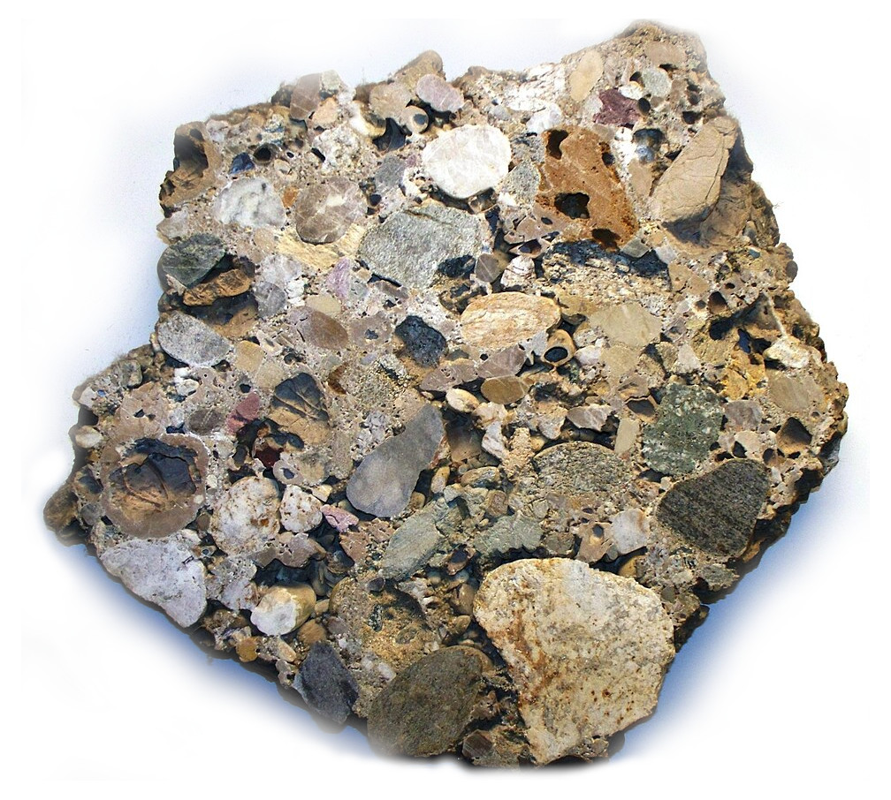
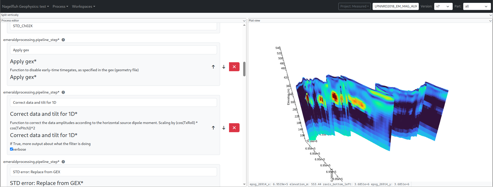
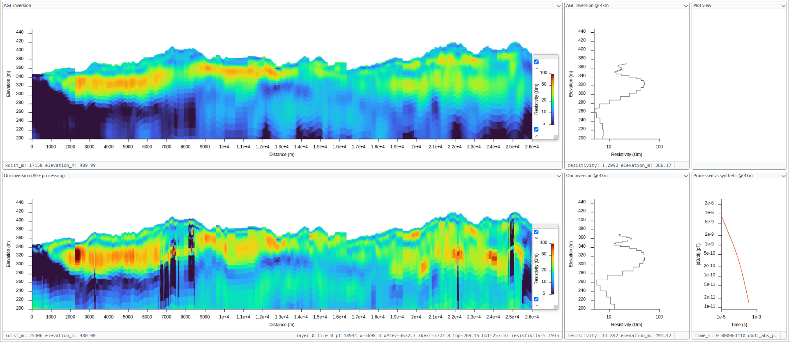

# Nagelfluh Geophysics



A geophysics data processing application with a React frontend and FastAPI backend. Provides a flexible, drag-and-drop layout system for managing data processing workflows, visualizing results with Plotly charts, and configuring process parameters via JSON Schema forms.

Processes are executed in Kubernetes containers with resource limits, job queuing (Kueue), and usage-based billing.

| Process graph view | Process editor |
|---|---|
| .png) |  |



## Features

### Flexible Layout System
- Drag-and-drop interface with resizable splits and tabs
- Popout windows for multi-monitor workflows
- Persistent layout configuration

### Process Management
- Visual process graph showing dependencies
- Real-time log streaming via WebSocket
- Resource management (CPU, memory, deadlines)
- Usage-based billing with upfront cost estimates

### Data Visualization
- Plotly-based scientific plotting
- Extensible plot element system
- Geographic map visualization
- Unit-aware axis matching

### Kubernetes Integration
- Containerized process execution with resource limits
- Kueue job queuing for cluster efficiency
- Automatic cleanup and retry logic
- Per-project storage isolation with IAM security

### Storage
- S3/GCS-compatible object storage
- MinIO for local development
- Per-project buckets with scoped credentials
- Automatic bucket provisioning

## Getting Started

See the **[Quickstart Guide](docs/quickstart.md)** to go from zero to a running system in minutes, or the **[Deployment Guide](docs/deployment.md)** for production-minikube mode, admin tools, and cloud deployment.

## Using the Application

Once running:

1. Select an environment (e.g., "Bootstrap")
2. Choose a process type (e.g., "fft", "inversion")
3. Configure resources (CPU, memory, deadline)
4. Fill in process parameters
5. Click "Submit" — the process runs in Kubernetes with real-time log streaming

See the **[User Guide](docs/user-guide.md)** for full coverage of the interface, datasets, billing, and troubleshooting.

## Documentation

Nagelfluh uses a distributed architecture with browser-based UI, FastAPI backend, and Kubernetes for process execution:

```
Frontend (React) → Backend (FastAPI) → Kubernetes Cluster
                                       ├─> Kueue → Job → Pod (process execution)
                                       ├─> Log streaming via WebSocket
                                       └─> MinIO (development) / GCS/S3 (production)
                                           └─> Per-project buckets with IAM
```

### Architecture
- **[System Overview](docs/architecture/overview.md)** - Backend/frontend components, data flow, Kubernetes resources
- **[Technology Stack](docs/architecture/technology-stack.md)** - Complete list of technologies, libraries, and tools
- **[Environment](docs/architecture/environment.md)** - Docker images, entrypoints, runner, schema extraction
- **[Process Types](docs/architecture/processes.md)** - Creating custom process types, schemas, registration
- **[Storage](docs/architecture/storage.md)** - Per-project buckets, security model, fsspec usage

### Frontend
- **[Widget System](docs/frontend/widgets.md)** - Creating widgets, built-in widgets, plot elements
- **[Layout System](docs/frontend/layout.md)** - Flexout drag-and-drop, splits, tabs, popouts
- **[JSON Schema Forms](docs/frontend/forms.md)** - Custom forms, dataset selector, validation

### Operations
- **[Deployment Guide](docs/deployment.md)** - Development and production setup, Minikube, MinIO, cloud deployment
- **[Development Guide](docs/development.md)** - Development workflows, testing, debugging, contributing

## What's Next

Current implementation includes:
- ✅ Kubernetes process execution with Kueue
- ✅ Real-time log streaming
- ✅ Resource limits and usage-based billing
- ✅ Per-project bucket storage with IAM security
- ✅ MinIO for local development
- ✅ Drag-and-drop layout system
- ✅ Process graph visualization
- ✅ Scientific plotting with Plotly

Planned enhancements (see `PLAN.md`):
- Forward modelling for AEM data
- 3D visualization (resistivity grids, curtains, terrain)
- Map underlays via WMS/WMTS
- Manual QC editor for data flagging
- Resistivity model simulator
- 3D gridding of flightline data
- High-performance plotting with WebGL

## Contributing

See [Development Guide](docs/development.md) for development workflows, testing, and contribution guidelines.

For guidance when working with Claude Code, see [CLAUDE.md](CLAUDE.md).

## License

Copyright (c) 2026 Egil Möller

This program is free software: you can redistribute it and/or modify
it under the terms of the GNU General Public License as published by
the Free Software Foundation, either version 3 of the License, or
(at your option) any later version.

This program is distributed in the hope that it will be useful,
but WITHOUT ANY WARRANTY; without even the implied warranty of
MERCHANTABILITY or FITNESS FOR A PARTICULAR PURPOSE. See the
GNU General Public License for more details.

You should have received a copy of the GNU General Public License
along with this program in the [LICENSE file](LICENSE). If not, see <https://www.gnu.org/licenses/>.
